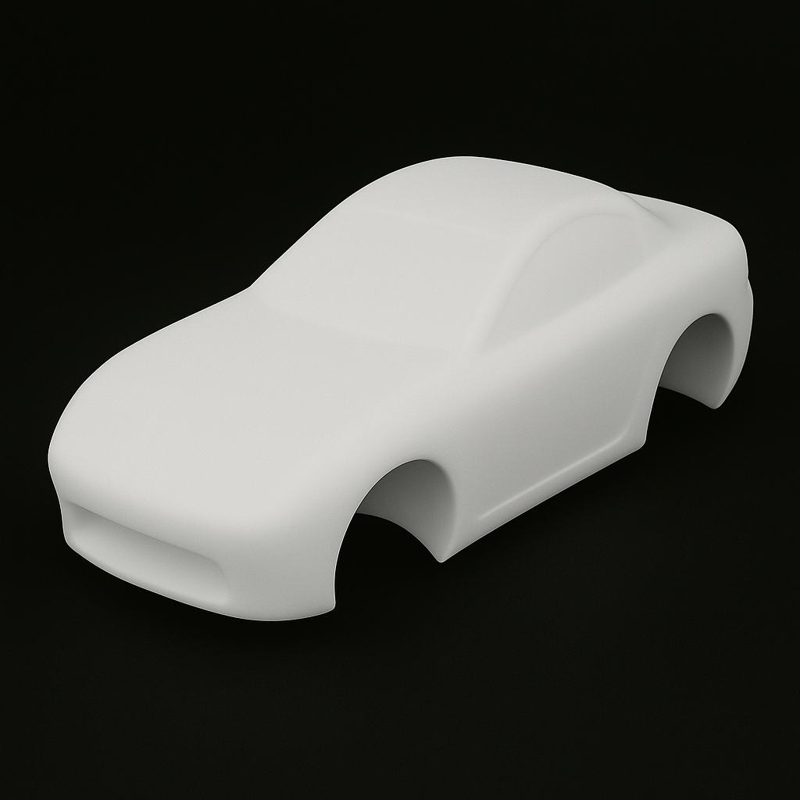
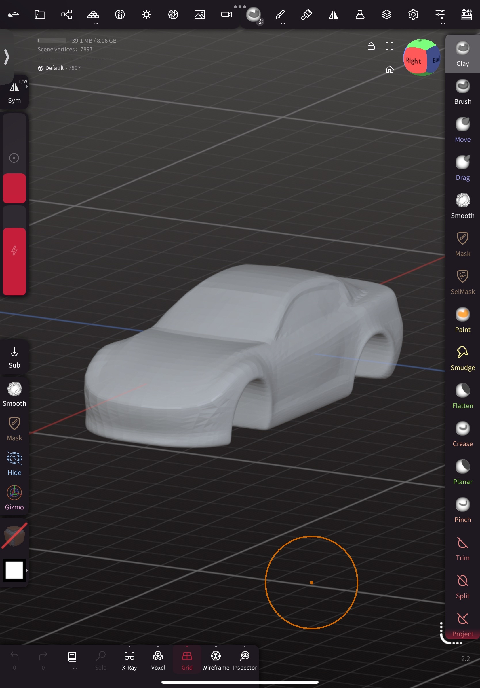
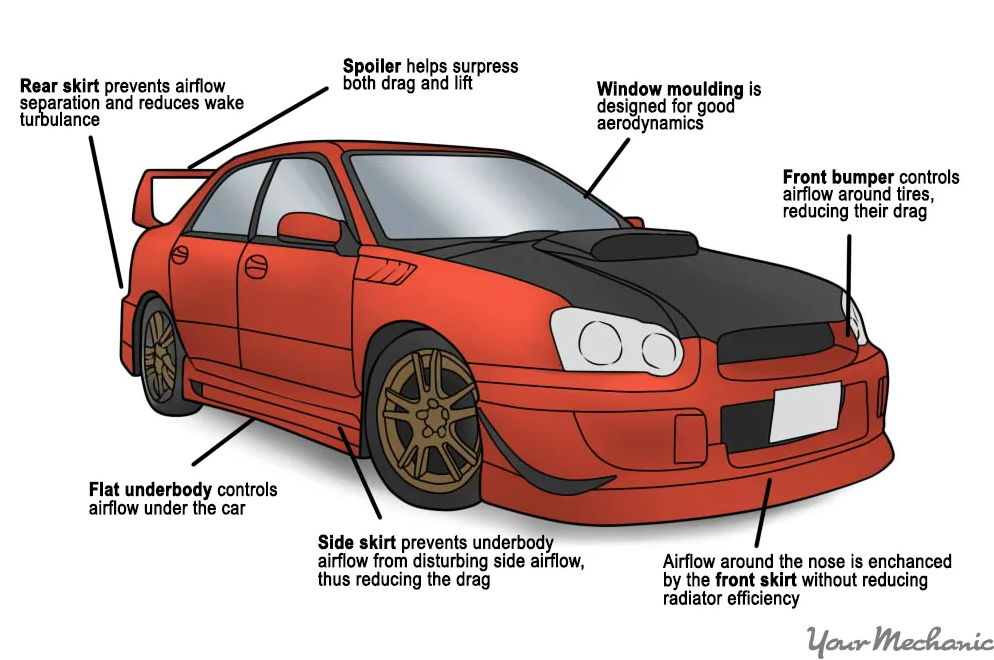
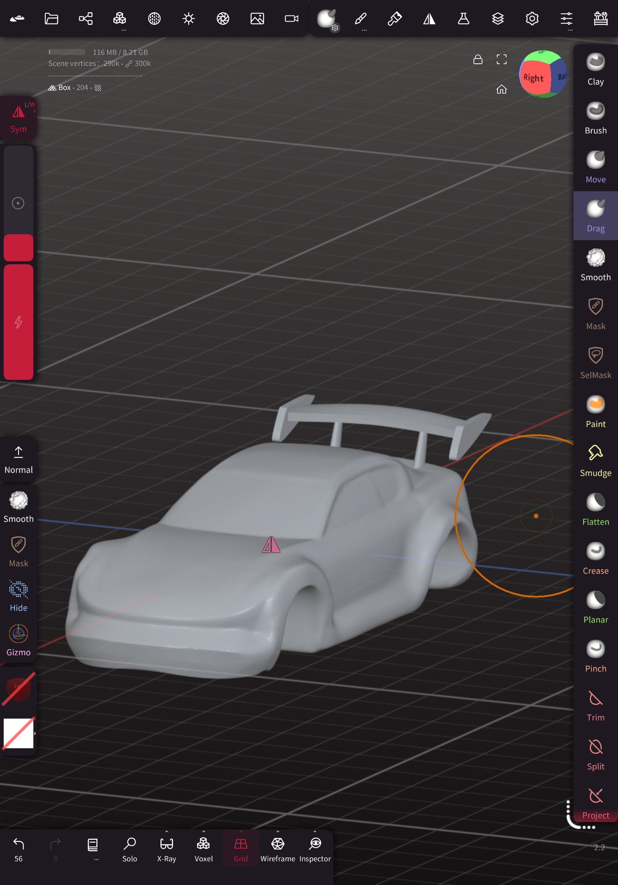
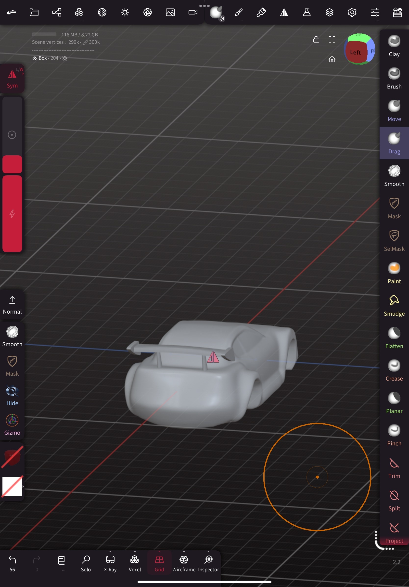
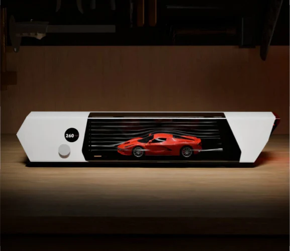

# Vehicle Design and Aerodynamics Project

---

## Abstract

This is a hands-on, project-based course that guides you through the process of creating a customized 3D car model using AI tools, refining it in Nomad Sculpt, 3D printing it, and transforming it into a fully functional 4WD remote-controlled (RC) vehicle. The course combines creative design, digital modeling, physical prototyping, and basic electronics.

---

## What You Will Learn

- How to use AI tools to generate 3D models of vehicles

- Techniques to import, clean, and refine models using Nomad Sculpt

- Customization of car components like bumpers, skirts, spoilers, etc.

- Preparing and slicing models for 3D printing

- Basics of 3D printing and post-processing techniques

- How to assemble and wire an RC 4WD chassis

- Presenting and testing your final product

## What You Will Need

| Category | Item | Notes | Required/Optional |
|----------|------|-------|------------------|
| Hardware | Smartphone/Tablet | With stylus support recommended | Required |
| | Laptop/Desktop | For slicing and 3D printing | Required |
| | FDM 3D Printer | e.g. BambuLab | Required |
| | Resin 3D Printer | for better finishing e.g. Phrozen | Optional |
| | RC Car 4WD Chassis Kit | Chassis for the car model | Required |
| Software | AI Model Generation | ChatGPT, Tripo AI | Required |
| | Nomad Sculpt | iOS/Android – paid | Required |
| | Nomad Sculpt Quad Remesh extention | iOS/Android – paid | Optional |
| | Slicing Software | Chitubox, Bambu Studio | Required |
| Tools & Materials | 3D Printer Filament | PLA or PETG recommended | Required |
| | Finishing Tools | Sandpaper or rotary tool | Optional |
| | Painting tools | Brushes, acrylic, Airbrush or spray paint| Optional |
| | RC Control System | Beets motor unit | Required |
| | Assembly Hardware | Screws, brackets, and mounting accessories | Required |

## Course Outline

### Chapter 1: Introduction to AI-Driven Design
- Overview of AI 3D generation tools
- Limitations of AI generated 3D models
- Exploring car design prompts and outputs
- Generate a car model image using ChatGPT
- Use the images to generate 3D models using Tripo AI

### Chapter 2: Sculpting Foundations in Nomad Sculpt
- Introduction to sculpting interface
- Importing and repairing AI-generated models
- Cleaning geometry and optimizing meshes
- Refining car body shape and proportions

### Chapter 3: Customizing the Car
- Adding car skirts, bumpers, fenders, spoilers, etc.
- Feedback sessions on design choices
- Exporting final car body for print

### Chapter 4: 3D Printing
- Introduction of different 3D printing methods
- Exporting STL files and configuring printer settings
- Model slicing basics: orientation, supports, infill
- Slice and preview print in Bambu Studio
- Operate a 3D printer and print

### Chapter 5: Post-Processing and assembly
- Sanding the printed model
- painting the car body
- Various post-processing techniques

### Chapter 6: testing
- Understanding and installing key RC components (Motor, servo, wheels)
- Mounting the body securely on the chassis
- Testing and calibrating your RC car for performance

## Project Steps

### 1. Generating the 3D Model

**Objective**: Create an initial 3D car model using AI tools.

**Content**:
1. Learn and practice AI prompts and generate a blank car model using ChatGPT
2. Use Tripo AI to generate a 3D model:
   - Upload your reference image
   - Adjust generation parameters as needed
   - Download the generated 3D model

{width=500 height=500}

### 2. Model Modification

**Objective**: Customize the car model's appearance.

**Content**:
1. Import the generated model into Nomad Sculpt
2. Remesh the model(Preferrably Quad Remesh Tool)
3. Learn about basic car customisation options
4. Use basic modification tools:
   - Masking tool for maintaining certain parts
   - Move and Drag tool for reshaping windshield and overall shape
   - Clay for skirts, fender and smooth it
   - Clay, move and smooth for front bumper and rear bumper
   - Use Primitives and trim tool for spoilers
   - Smooth tool for evening out rough spots

### 3. Preparing for 3D Printing

**Objective**: Export the 3D model for printing.

**Content**:
1. Export model from Nomad in STL format
2. Import into slicer software:
   - Adjust model orientation for optimal printing
   - Add support structures
   - Configure print settings (layer height, infill, etc.)
3. Generate G-code and print

### 4. Post-processing, assembly and test running
1. Remove support structures
2. sand the surfaces and support structure marks
3. Assemble the car cover onto the Chassis and Beets motor unit

## Optional Projects 

### 3D scanning
   - 3D scanning can be used instead of AI model generation. Students can experience the process of scanning real life toy cars and import them into Nomad.
   - Scanned models takes more time and proficiency to fix so this is not recommended for first timers. 

### Wind Tunnel Testing 
   - Learn about the basic aerodynamic principles and the usage of a wind tunnel
   - Test different car designs for aerodynamic efficiency
   - Observe the behaviour of Streamlines and compare them for different student designs
   - Document results and make design improvements
   - This is mainly aimed towards Physics/Engineering related students

> Note: Images shown are placeholders. Replace with actual project photos.

