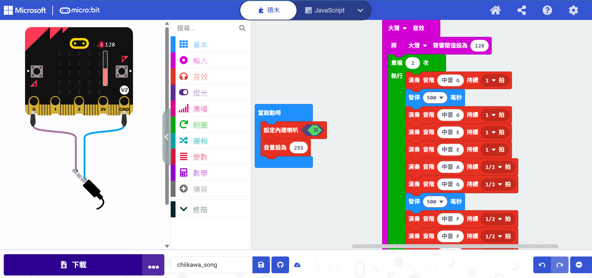

---

# Micro:bit Guide

---

## 目標

本程式的目標是：

- **偵測聲音** → 當 micro:bit 聽到聲響，就開始播放音樂。

- **播放旋律** → 根據設定的音符播放歌曲。

- **循環兩次** → 確保完整旋律播放兩次後才停止。

.png)

## 完整步驟

**步驟 1：初始化音樂系統**

- 開啟內建喇叭

  -使用 設定內建喇叭為開，確保 micro:bit 能夠播放聲音。

-設置音量

  -音量設為 255，將音量設定為最高，確保聲音清晰可聞。

**步驟 2：偵測聲音**

-使用「當偵測到大聲」觸發程式

  -當 micro:bit 聽到外部聲響 (如拍手、敲擊)，程式開始執行。

  -這個事件由 on loud sound detected (偵測到大聲音) 來觸發。

**步驟 3：播放旋律**

- 使用「重複執行 2 次」來確保旋律播放兩次

  - 在 重複執行 2 次 (repeat 2 times) 內部，執行播放音符的指令。

- 播放音符

  - 旋律細節：

    演奏 G 中音 持續 1 拍 → 播放 G 音

    暫停 500 毫秒 → 暫停一下

    演奏 E 中音 持續 1 拍 → 播放 E 音

    演奏 A 中音 持續 1/2 拍 → 短暫播放 A 音

    演奏 G 中音 持續 1/2 拍 → 短暫播放 G 音

    暫停 500 毫秒 → 再次暫停

    演奏 F 中音 持續 1/2 拍 → 播放 F 音

    演奏 F 中音 持續 1/2 拍 → 再次播放 F 音

## 原理與邏輯

**事件觸發機制**

- 使用 當偵測到大聲 作為 觸發條件，確保程式只有在偵測到聲音時執行。

**循環執行**

- 重複執行 2 次 保證旋律播放兩次，讓歌曲完成後才停止，而不是無限循環。

**音符與節奏控制**

- 使用 不同拍數 (1 拍, 1/2 拍) 來塑造旋律，使音樂更流暢。

- 適當插入 暫停 500 毫秒，確保旋律不會太快，符合歌曲風格。

這樣，micro:bit 就能根據聲音輸入播放兩次旋律，然後停止！