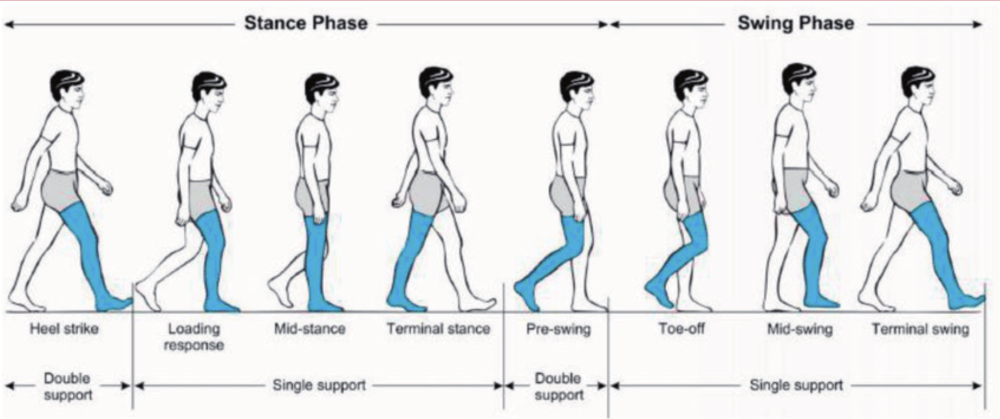
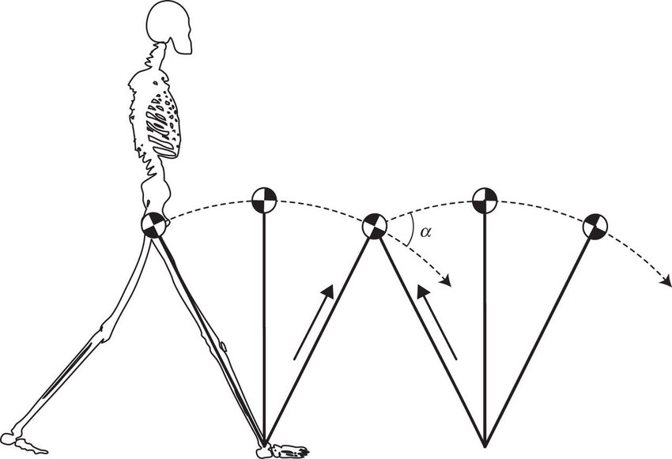

# 行走機器人的行走概念

[返回行走機器人項目概述](index.zh_HK.md)

## 基本原則

要實現雙腿機器人的行走，必須理解幾個概念和機制。雙足機器人的運動主要基於平衡、能量守恆和腿部交替角色的原則。

## 如何用兩條腿進行機器人行走
### 倒立擺模型

基本的行走機制可以建模為倒立擺。在這個模型中，一條腿作為支撐腿，而另一條腿則向前擺動以進行下一步。支撐腿與地面保持接觸，提供穩定性，而擺動腿則為下一步做準備。

### 步幅動力學

機器人的行走涉及一系列的階段：

1. 支撐腿以擺動的方式前後移動。
2. 從屬腿過渡為支撐腿，讓另一條腿向前擺動。

這種交替運動對於保持平衡和向前推進至關重要 [1]。

### 能量管理

為了有效行走，機器人必須有效管理能量。在從屬腿與地面接觸時損失的能量必須由內部能量供應來補償，以維持支撐腿的擺動 [1]。

## 使其向前移動的原因

雙足機器人的向前運動主要是由其腿部的協調運動和行走周期中的能量守恆所引起的。以下因素促成了這一運動：

- **腿部角色交替**：支撐腿和從屬腿之間的持續角色切換允許無縫過渡，推動機器人向前。
- **擺動運動**：支撐腿的擺動運動在擺動時產生向前的推力，而從屬腿則為下一步做準備 [1]。
- **控制時機**：腿部運動的精確時機確保機器人在向前移動時保持平衡，防止跌倒並保持穩定的步態 [2]。

## 影響此運動的屬性
### 物理屬性

幾個屬性影響雙足機器人的行走運動：

- **腿長和關節配置**：腿的長度和關節（髖關節、膝關節、踝關節）的配置影響行走時的運動範圍和穩定性 [1]。
- **重心**：質量的分佈和重心在保持平衡中起著關鍵作用。較低的重心通常增強穩定性 [3]。

### 環境因素

- **表面條件**：表面的類型（平坦、傾斜或不平）影響機器人有效行走的能力。機器人必須根據不同的地形調整其步態，以保持平衡和向前運動 [1]。
- **控制算法**：用於控制機器人運動的算法，包括平衡調整和步態規劃，顯著影響行走性能 [2]。

## 這些屬性對輸出的影響
### 性能指標

上述屬性直接影響機器人的行走輸出，具體表現在幾個方面：

- **速度和效率**：腿的配置和重心可以增強或阻礙機器人的行走速度和能量效率。
- **穩定性和平衡**：一個良好設計的控制系統能夠考慮機器人的屬性，改善穩定性，減少運動過程中跌倒的可能性 [3]。
- **適應性**：能夠適應不同表面和條件使機器人能夠在各種環境中保持有效行走，影響其整體功能和性能 [1]。

## 總結

雙足機器人的行走運動是機械設計、能量管理和控制策略之間的複雜相互作用，所有這些都必須精細調整以實現有效的運動。

[返回行走機器人項目概述](index.zh_HK.md) 