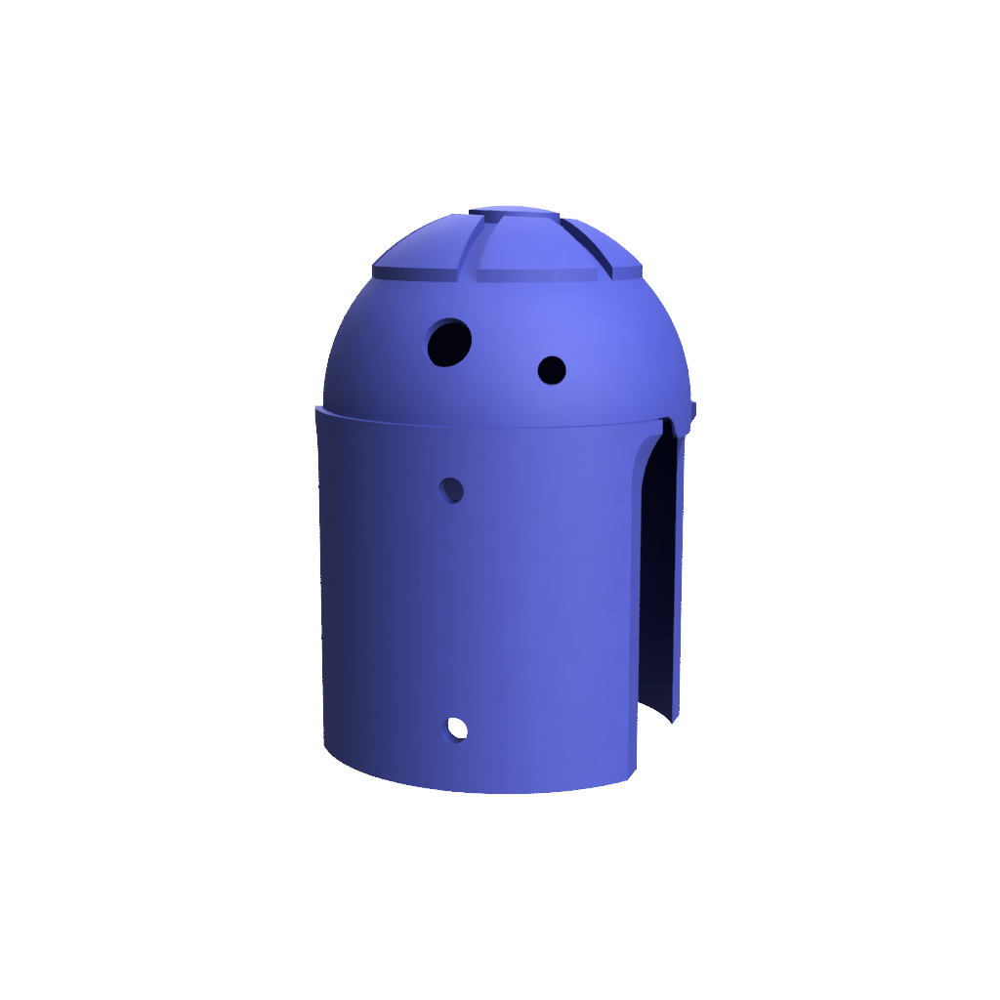
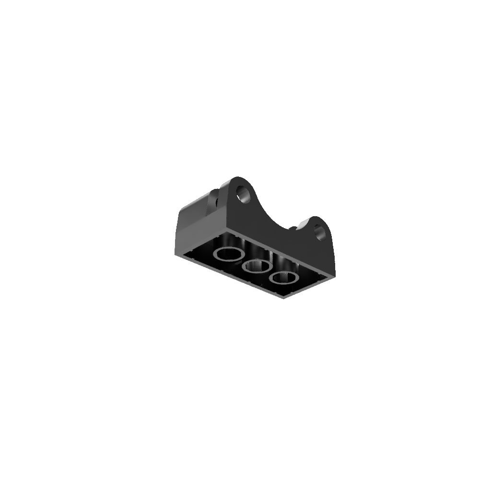

# Walking Robot  (B3D1) Project 

## What is this?

The name B3D1 may evoke memories of R2D2, but it actually stands for "Beets 3D1mension," a tribute to Beets3D, the innovative company and team behind this exciting project. 

  { width=30% }
  { width=30% }
  { width=30% }

This walking crank robot serves as a practical demonstration of fundamental walking mechanism concepts through engaging hands-on experimentation. It provides an educational platform for students and teachers to investigate how various physical attributes influence robot locomotion. By altering essential components such as leg length and foot design with LEGO blocks, students can explore:

- Walking speed and efficiency
- Stability and balance of the robot
- Various walking gaits and patterns

Grasping the principles of walking mechanisms, balance, and motion dynamics is essential for fostering a deeper understanding of robotics. For more information, please refer to the [Concepts of Walking](concept-of-walking.md) page.

Key Features:

- Modular design for easy modification
- Basic walking functions (forward movement and potential turn left/right)
- Customizable foot attachments for experimenting with different concepts by changing leg length and foot design by using LEGO blocks
- Remote control capability to test different walking patterns

The robot serves as an excellent teaching tool for understanding mechanical principles, robotics fundamentals, and the relationship between design choices and movement outcomes.

## What you will learn
- **Mechanical Principles**: Walking mechanisms, balance, motion dynamics
- **Design & Experimentation**: Testing different foot designs, leg lengths, and their effects on robot movement
- **Electronics**: Working with micro:bit, motor control, basic circuitry
- **Coding**: Programming to control robot, and remote control 
- **Engineering**: Understanding gear systems, mechanical advantage
- **Problem Solving**: Analyzing movement patterns, improving stability, optimizing performance
- **Documentation**: Recording observations, comparing different configurations
- **Teamwork**: Collaborative experimentation, sharing findings
- **STEM Integration**: Connecting physics concepts with real-world robotics applications

## What you need

### Hardware

- 2x BBC micro:bit
- USB cable for programming (please note V2 is used to developed this project)
    - 1x Main control board for connecting to Micro:bit including motor driver and Battery pack (developed by Beets3D)
    - 4 X AA Batteries
    - 2x Geared motors (N20 DC motor)
    - 3D printed parts (chassis and mechanical components)
    - Outer shell components (External casing)
    - LEGO blocks (for modifications)

### Software
- MakeCode for micro:bit (web-based programming platform Or using iPad app)
- 3D printing software (for customizing parts, recommended using Fusion 360)

### Tools
- Screwdriver
- Wire cutters/strippers (for jumper wires)
- 3D printer access (for parts)

### Age
Suitable for ages 11-17 

## How it works
{ width=80% }

### The Design

It is designed using Autodesk Fusion 360, the STEP file is available in [Design File](cad/Walking-Crank-Robot-v91.step).

#### Core Walking Mechanism
   - **Motor Unit** - consists of 2 geared motors that provide the necessary torque and speed for the robot's movement. These motors are strategically positioned to optimize the walking mechanism, allowing for smooth and coordinated leg movements. The geared design enhances the efficiency of power transfer, ensuring that the robot can navigate various terrains effectively. 
   {: style="width: 50%; display: block; margin-left: auto; margin-right: auto;"}

   - **Leg (left / right)** - consists of a leg with a mechanism that simulates walking in a pendulum motion. This design allows the leg to move back and forth smoothly, mimicking how a human leg walks. The foot includes a LEGO-compatible attachment, making it easy to customize and change the foot design. This feature encourages experimentation with different shapes and sizes to see how they affect the robot's movement and balance.

   {: style="width: 30%; display: inline-block; margin-right: 10px;"} {: style="width: 30%; display: inline-block;"} 
      
   {: style="width: 30%; display: inline-block; margin-right: 10px;"} {: style="width: 30%; display: inline-block;"}

#### Electronics
   - **Main Board** - Serves as the central hub for the robot, featuring a dedicated slot for the micro:bit unit, which acts as the brain. It integrates the motor driver and facilitates seamless connectivity to both the motors and the battery pack, ensuring efficient power distribution and control.

  - **Micro:bit** - The Micro:bit is a compact, versatile microcontroller designed for educational purposes. It features a range of sensors, buttons, and LED lights, making it an ideal choice for programming and robotics projects. In this robot, the Micro:bit acts as the brain, controlling the motors and processing inputs from the user. 

      {: style="width: 30%; display: inline-block; margin-left: auto; margin-right: auto;"} {: style="width: 30%; display: inline-block;margin-left: auto; margin-right: auto;"} 
      
   - **Battery Cases** - The battery cases are designed to securely hold the power source for the robot, ensuring that the batteries are protected and easily accessible for replacement. A well-designed battery case contributes to the overall stability of the robot by maintaining a low center of gravity, which is crucial for effective walking. Proper weight distribution helps prevent tipping and enhances the robot's balance during movement.

#### Outter Shell
   - **Body**- This is the main body of the walking robot, designed to house the internal components and provide structural support for the legs and head.
      {: style="width: 50%; display: block; margin-left: auto; margin-right: auto;"}

   - **Head** - This component serves as the robot's head, providing a visual representation and housing any necessary sensors or features for interaction. This can be customised according the learning needs.
      {: style="width: 50%; display: block; margin-left: auto; margin-right: auto;"}
   - **Outer Shell** - This component provides the external casing for the robot, giving a nice outlook and customise base any requirements.  
      {: style="width: 50%; display: block; margin-left: auto; margin-right: auto;"}

#### Remote Control
You can use another Micro:bit to control the walking pattern by pressing the A or B button. Each button corresponds to the movement of one leg; pressing a button will make the associated leg step forward. For example, let's assume the A button controls the left leg and the B button controls the right leg. When you press the A button, the left leg will step forward, and when you press the B button, the right leg will step forward. This setup allows you to manage the timing and motion of both legs, providing an opportunity to explore how "control timing" affects balance, speed, and direction during walking.

#### Customization Options
   - **LEGO attachment** - Foot is designed to allow any LEGO attachment to be added
      {: style="width: 30%; display: inline-block; margin-left: auto; margin-right: auto;"} 
      {: style="width: 30%; display: inline-block;margin-left: auto; margin-right: auto;"} 

   - **Adjustable leg lengths** - With the LEGO attachment, you can adjust the length of the legs by adding LEGO blocks, which will change the range of motion for each steps.
   - **Adjustable foot shape** - You can also design the any shapes to test out the different effect to walking behavior, taking consideration of balance.

### Assembly Guide
1. Mechanical Assembly
   - Left and right legs assembly
   - Motor and gear installation
   - Main board installation
   - Install Micro:bit to main board
   - LEGO attachment points setup

2. Electronics Setup
   - Micro:bit wiring
   - Battery pack setup

3. Programming
   - Basic Micro:bit programming using MakeCode
   - Remote control setup
   - Testing and calibration

## Lesson Plan
1. **Day 1: Introduction and Design** (45 min)
   - Walking mechanism principles
   - Robot components overview
   - Safety guidelines
   
2. **Day 2: Assembly** (45 min)
   - Mechanical assembly
   - Electronics connection
   - Initial testing
   
3. **Day 3: Programming** (45 min)
   - MakeCode basics
   - Movement programming
   - Remote control setup
   
4. **Day 4: Experimentation** (45 min)
   - Foot design testing
   - Performance optimization
   - Documentation of results

## Exercise
1. Basic Walking Test
   - Forward/backward movement
   - Speed measurement
   - Stability assessment

2. Design Challenges
   - Create different foot designs
   - Test various leg lengths
   - Compare walking efficiency

3. Documentation
   - Record observations
   - Compare different configurations
   - Present findings

## Student / Teacher Materials
### Student Resources

- Assembly guide with pictures
- Programming tutorial
- Experiment worksheet
- Design challenge tasks

### Teacher Resources
- Detailed lesson plans
- Assessment rubrics
- Troubleshooting guide
- Extension activities
