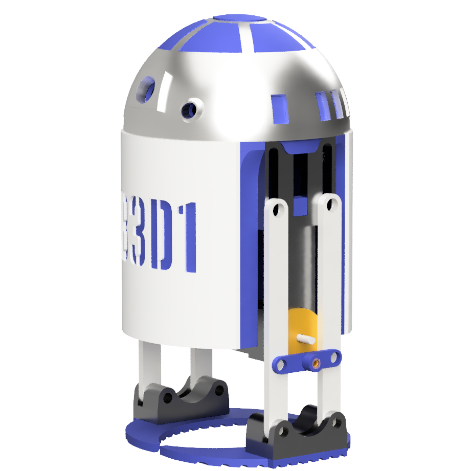
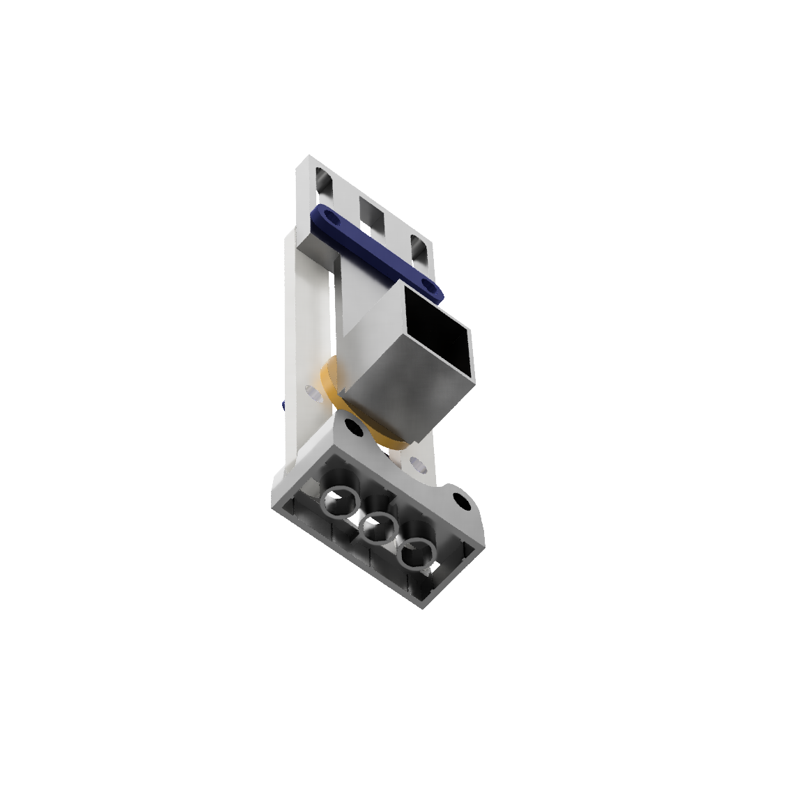
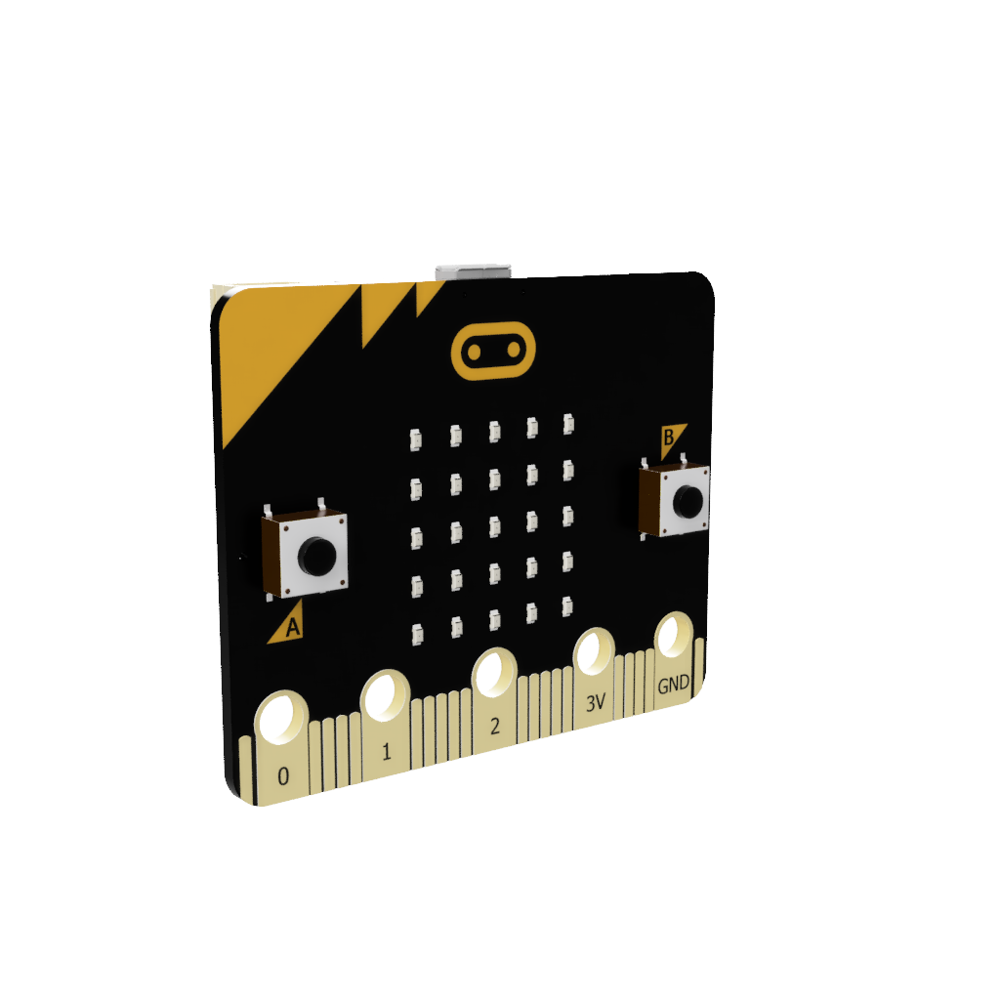
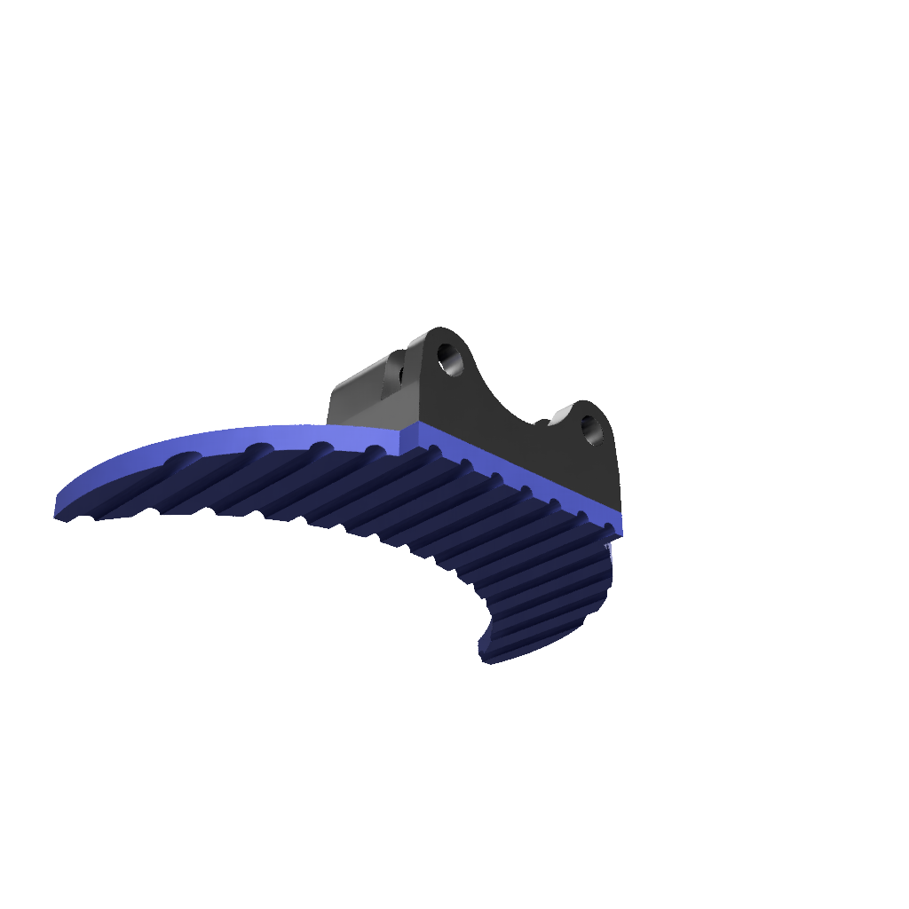

# Walking Robot  (B3D1) Project 

---

## What is this?

The name B3D1 may evoke memories of R2D2, but it actually stands for "Beets 3D1mension," a tribute to Beets3D, the innovative company and team behind this exciting project. 

  { width=30% }
  { width=30% }
  { width=30% }

This walking crank robot serves as a practical demonstration of fundamental walking mechanism concepts through engaging hands-on experimentation. It provides an educational platform for students and teachers to investigate how various physical attributes influence robot locomotion. By altering essential components such as leg length and foot design with LEGO blocks, students can explore:

- Walking speed and efficiency
- Stability and balance of the robot
- Various walking gaits and patterns

Grasping the principles of walking mechanisms, balance, and motion dynamics is essential for fostering a deeper understanding of robotics. For more information, please refer to the [Concepts of Walking](concept-of-walking.md) page.

Key Features:

- Designed to be easily modified with interchangeable parts
- Can walk forward and has the ability to turn left or right
- Foot attachments can be customized using LEGO blocks, allowing for experiments with different leg lengths and foot designs
- Equipped with remote control functionality to try out various walking patterns

The robot acts as a powerful educational resource, enabling learners to grasp essential mechanical principles, foundational concepts in robotics, and the intricate connections between design decisions and their impact on movement performance.

---

## What you will learn
- **Mechanical Principles**: Walking mechanisms, balance, motion dynamics
- **Design & Experimentation**: Testing different foot designs, leg lengths, and their effects on robot movement
- **Electronics**: Working with micro:bit, motor control, basic circuitry
- **Coding**: Programming to control robot, and remote control 
- **Engineering**: Understanding gear systems, mechanical advantage
- **Problem Solving**: Analyzing movement patterns, improving stability, optimizing performance
- **Documentation**: Recording observations, comparing different configurations
- **Teamwork**: Collaborative experimentation, sharing findings
- **STEM Integration**: Connecting physics concepts with real-world robotics applications

### What you need

#### Hardware

| Item                                         | Description                                                                 | Quantity | Required/Optional |
|----------------------------------------------|-----------------------------------------------------------------------------|----------|----------|
| BBC micro:bit                               | Compact microcontroller for controlling the robot                          | 2        | Y        |
| USB cable for programming                    | Cable used for programming the micro:bit (V2 is used for this project)    | 1        | Y        |
| Main control board                           | Board for connecting to micro:bit, including motor driver and battery pack | 1        | Y        |
| AAA Batteries                                 | Power source for the robot                                                 | 4        | Y        |
| Geared motors (N20 DC motor)                | Motors providing torque and speed for movement                              | 2        | Y        |
| 3D printed parts                             | Chassis and mechanical components (links to STLs)                          | Various  | Y        |
| Outer shell components                       | External casing for the robot                                             | Various  | Y        |
| Screw M4X10                                  | Screws for assembly                                                        | 8        | Y        |
| Screw M4X5                                   | Screws for assembly                                                        | 4        | Y        |
| Screw M2                                     | Screws for assembly                                                        | 2        | Y        |
| LEGO blocks                                  | For modifications and customization                                        | Various  | N        |

#### Software
| Item                                         | Description                                                                 | Required/Optional |
|----------------------------------------------|-----------------------------------------------------------------------------|----------|
| MakeCode for micro:bit                      | Web-based programming platform or using iPad app                           | Y        |
| Code for main Walking Robot                  | [Link to code](https://beets3d.github.io/b3d1-walking-bot-main/)         | Y        |
| Code for remote controller                   | [Link to code](https://beets3d.github.io/b3d1-walking-bot-controller/)   | Y        |
| 3D printing software                         | For customizing parts, recommended using Fusion 360                        | N        |

#### Tools
| Item                        | Description                                         | Required/Optional |
|-----------------------------|-----------------------------------------------------|----------|
| Screwdriver                 | Tool for assembling and disassembling components    | Y        |
| Wire cutters/strippers      | Tool for cutting and stripping jumper wires         | Y        |
| 3D printer access           | Access to a 3D printer for printing 3D models      | N        | 

#### Age
Suitable for ages 11-17 

---

## How it works
{ width=80% }

### The Design

#### Core Walking Mechanism
   - **Motor Unit** - consists of 2 geared motors that provide the necessary torque and speed for the robot's movement. These motors are strategically positioned to optimize the walking mechanism, allowing for smooth and coordinated leg movements. The geared design enhances the efficiency of power transfer, ensuring that the robot can navigate various terrains effectively. 
   {: style="width: 50%; display: block; margin-left: auto; margin-right: auto;"}

   - **Leg (left / right)** - consists of a leg with a mechanism that simulates walking in a pendulum motion. This design allows the leg to move back and forth smoothly, mimicking how a human leg walks. The foot includes a LEGO-compatible attachment, making it easy to customize and change the foot design. This feature encourages experimentation with different shapes and sizes to see how they affect the robot's movement and balance.

   {: style="width: 30%; display: inline-block; margin-right: 10px;"} {: style="width: 30%; display: inline-block;"} 
      
   {: style="width: 30%; display: inline-block; margin-right: 10px;"} {: style="width: 30%; display: inline-block;"}

#### Electronics
   - **Main Board** - Serves as the central hub for the robot, featuring a dedicated slot for the micro:bit unit, which acts as the brain. It integrates the motor driver and facilitates seamless connectivity to both the motors and the battery pack, ensuring efficient power distribution and control.

  - **Micro:bit** - The Micro:bit is a compact, versatile microcontroller designed for educational purposes. It features a range of sensors, buttons, and LED lights, making it an ideal choice for programming and robotics projects. In this robot, the Micro:bit acts as the brain, controlling the motors and processing inputs from the user. 

      {: style="width: 30%; display: inline-block; margin-left: auto; margin-right: auto;"} {: style="width: 30%; display: inline-block;margin-left: auto; margin-right: auto;"} 

   - **Battery Cases** - The battery cases are designed to securely hold the power source for the robot, ensuring that the batteries are protected and easily accessible for replacement. A well-designed battery case contributes to the overall stability of the robot by maintaining a low center of gravity, which is crucial for effective walking. Proper weight distribution helps prevent tipping and enhances the robot's balance during movement.

#### Outter Shell
   - **Body**- This is the main body of the walking robot, designed to house the internal components and provide structural support for the legs and head.
      {: style="width: 50%; display: block; margin-left: auto; margin-right: auto;"}

   - **Head** - This component serves as the robot's head, providing a visual representation and housing any necessary sensors or features for interaction. This can be customised according the learning needs.
      {: style="width: 50%; display: block; margin-left: auto; margin-right: auto;"}
   - **Outer Shell** - This component provides the external casing for the robot, giving a nice outlook and customise base any requirements.  
      {: style="width: 50%; display: block; margin-left: auto; margin-right: auto;"}

#### Remote Control
You can use another Micro:bit to control the walking pattern by pressing the A or B button. Each button corresponds to the movement of one leg; pressing a button will make the associated leg step forward. For example, let's assume the A button controls the left leg and the B button controls the right leg. When you press the A button, the left leg will step forward, and when you press the B button, the right leg will step forward. This setup allows you to manage the timing and motion of both legs, providing an opportunity to explore how "control timing" affects balance, speed, and direction during walking.

#### Customization Options
   - **LEGO attachment** - Foot is designed to allow any LEGO attachment to be added
      {: style="width: 30%; display: inline-block; margin-left: auto; margin-right: auto;"} 
      {: style="width: 30%; display: inline-block;margin-left: auto; margin-right: auto;"} 

   - **Adjustable leg lengths** - With the LEGO attachment, you can adjust the length of the legs by adding LEGO blocks, which will change the range of motion for each steps.
   - **Adjustable foot shape** - You can also design the any shapes to test out the different effect to walking behavior, taking consideration of balance.

### Assembly Guide

1. Mechanical Assembly
1.1 Motor and gear installation

**Parts involve:**

   | Item               | Description                | Quantity | Image                | Link          |
   |--------------------|----------------------------|----------|----------------------|----------------------|
   | Motor (N20 DC Motor) | Small DC motor for driving | 2        |  | [Source](link_to_source) |
   | Motor case         | Enclosure for the motor    | 1        |  | [Source](link_to_source) |

**Video**

1.2 Left and right legs assembly

**Parts involve:**

   | Item                                             | Description                       | Quantity | Image | Link |
   |--------------------------------------------------|-----------------------------------|----------|-------|------|
   | Left_Walking-Crank-Robot v103_Body1.stl         | Main body component                | 2        |       |      |
   | Left_Walking-Crank-Robot v103_control-bar-bottom_1_Body1.stl | Control bar bottom component       | 2        |       |      |
   | Left_Walking-Crank-Robot v103_control-bar-upper_1_Body1.stl | Control bar upper component        | 2        |       |      |
   | Left_Walking-Crank-Robot v103_foot_1_Body4.stl  | Foot component                     | 2        |       |      |
   | Left_Walking-Crank-Robot v103_foot_1_foot-palm-L_1_Body1.stl | Foot palm component                | 2        |       |      |
   | Left_Walking-Crank-Robot v103_gear_1_Body1.stl  | Gear component                     | 2        |       |      |
   | Left_Walking-Crank-Robot v103_things_1_Body1.stl | Additional component 1            | 2        |       |      |
   | Left_Walking-Crank-Robot v103_things_1_Body2.stl | Additional component 2            | 2        |       |      |
   | Screw M4X5                                       | Screw for assembly                 | 4        |       |      |
   | Screw M4X10                                      | Longer screw for assembly          | 8        |       |      |
   | Screw M2                                         | Small screw for assembly           | 2      |       |      |

**Video**

1.3 Main board installation

**Part involves:**

**Video**

1.4 Install Micro:bit to main board

**Part involves:**
- 1 x
**Video**

1.5 Battery Cases

**Part involves:**

**Video**

**Part involves:**

| Item                     | Description                          | Quantity | Dimensions (mm)         | Image                | Link          |
|--------------------------|--------------------------------------|----------|--------------------------|----------------------|----------------|
| Battery Case for AAA     | Holds 2 AAA batteries                | 2        | 30 x 21.5 x 68           |  | [Source](link_to_source) |

**Video**

1.6 Body and Outter Shell

**Part involves:**

**Video**

1.7 Remote Control

**Part involves:**

**Video**

2. Programming

2.1 Basic Micro:bit programming using MakeCode

2.2 Remote control setup

2.3 Testing and calibration

---
## Lesson Plan

###Course Objectives:

- Understand walking mechanics (balance, torque, gait patterns).
- Design and build a functional walking robot using the B3D1 kit. (optional)
- Integrate coding (micro:bit) for motor control and remote operation. (optional)
- Experiment with modifications to optimize performance.
- Foster problem-solving through iterative testing and documentation.

### Course Structure

Total Sessions: 10 core + 4 optional
Session Duration: 40–60 minutes

##### Objective 1: Understand Walking Mechanics (Balance, Torque, Gait Patterns)

- **Session 1: Biomechanics Basics**  
  - **Exercise:** Gait Diagramming – Compare human/insect gaits using stick-figure animations.  
  - **Duration:** 50 min  
  - **Aligns with:** Balance, gait patterns.  

  For details, please go to [Exercise: Gait Diagramming](exercise-gait-diagramming.md)

- **Session 2: Torque & Balance**  
  - **Exercise:** Teeter-Totter Test – Use LEGO weights to adjust robot balance on a fulcrum.  
  - **Duration:** 50 min  
  - **Aligns with:** Torque, balance.  

For details, please go to [Exercise: Teeter-Totter Test](exercise-teeter-totter-test.md)

##### Objective 2: Design & Build the B3D1 Robot (Optional 🔧)  

- **Session 3: Mechanical Assembly**  
  - **Exercise:** Gearbox Relay – Assemble gear systems in teams, focusing on torque transfer.  
  - **Duration:** 60 min  

- **Session 4: Electronics Setup**  
  - **Exercise:** Circuit Detective – Diagnose wiring errors (e.g., loose motor connections).  
  - **Duration:** 50 min  

##### Objective 3: Integrate Coding (Optional 🔧)  

- **Session 5: Motor Control Basics**  
  - **Exercise:** Step Counter – Program the robot to walk 10 steps forward/backward.  
  - **Duration:** 60 min  

- **Session 6: Remote Control**  
  - **Exercise:** Maze Navigator – Code a remote to steer the robot through a simple course.  
  - **Duration:** 50 min  

##### Objective 4: Experiment with Modifications  

- **Session 7: Optimization Lab**  
  - **Exercise:** Foot Swap Challenge – Test LEGO feet on different surfaces.  
  - **Duration:** 50 min  
  - **Aligns with:** Modifications, performance.  

- **Session 8: Weight & Speed Trade-offs**  (optional 🔧)
  - **Exercise:** Payload Test – Add weights to the robot and measure speed reduction.  
  - **Duration:** 50 min  

##### Objective 5: Foster Problem-Solving  

- **Session 9: Debugging Workshop**  (optional 🔧)
  - **Exercise:** Sabotage & Fix – Introduce a design flaw (e.g., misaligned legs) for teams to troubleshoot.  
  - **Duration:** 60 min  

- **Session 10: Final Project**  
  - **Exercise:** Robot Olympics – Optimize the robot for a custom task (e.g., uphill climb).  
  - **Duration:** 60 min  

**Optional Pathways**  
- **Build & Code Track (Sessions 3–6):** For students building the full kit.  
- **Experiment-Only Track (Sessions 7–10):** Use pre-built robots to focus on testing/documentation.  

**Flexibility Notes:**  
- **No-Kit Option:** Replace B3D1 assembly with virtual simulations (e.g., Tinkercad).  
- **Assessment:** Use lab journals (Objective 5) to evaluate iterative problem-solving.  

This structure ensures core focus on mechanics, experimentation, and problem-solving, while optional sessions let you tailor depth for different groups.  