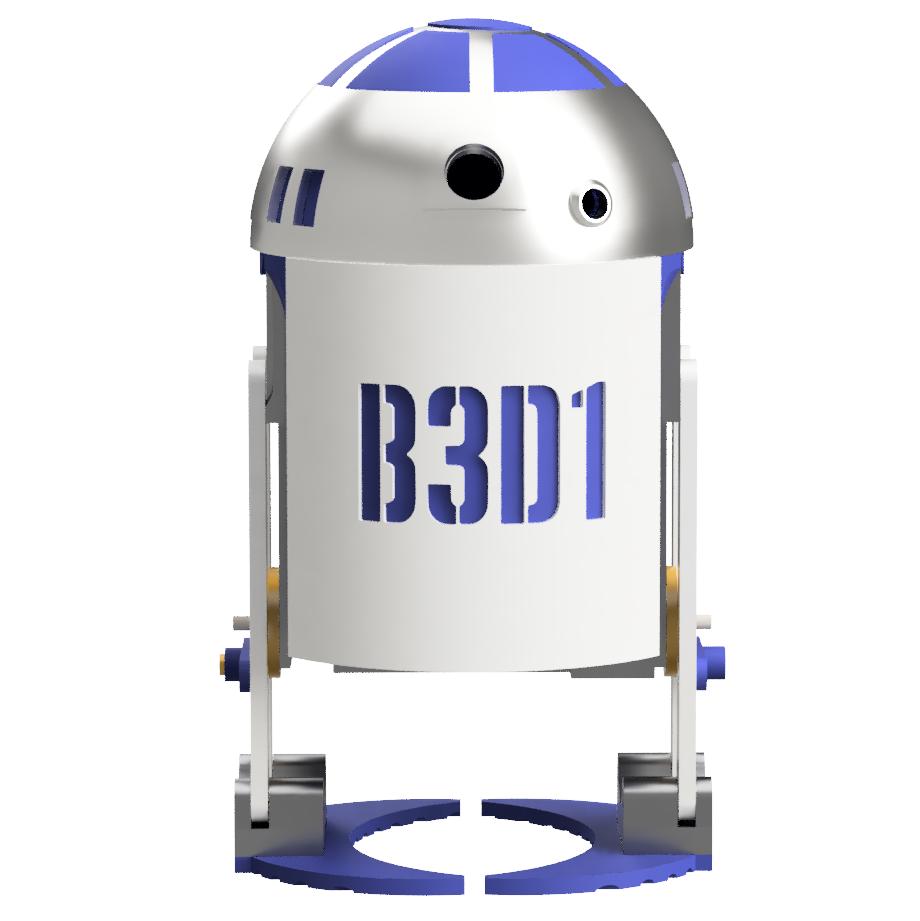
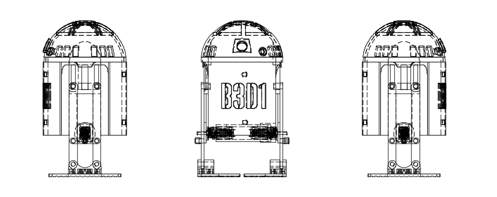
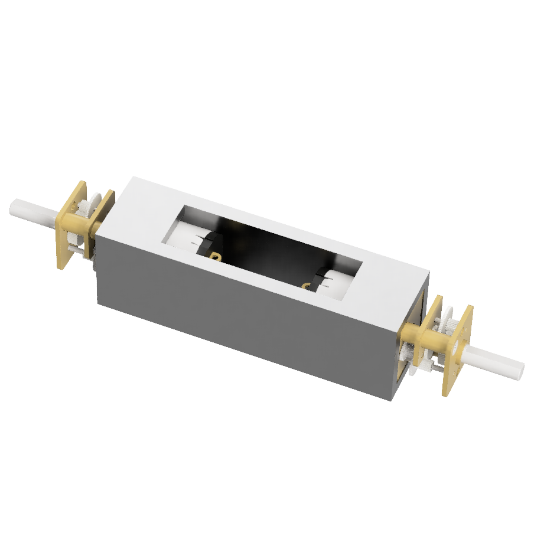
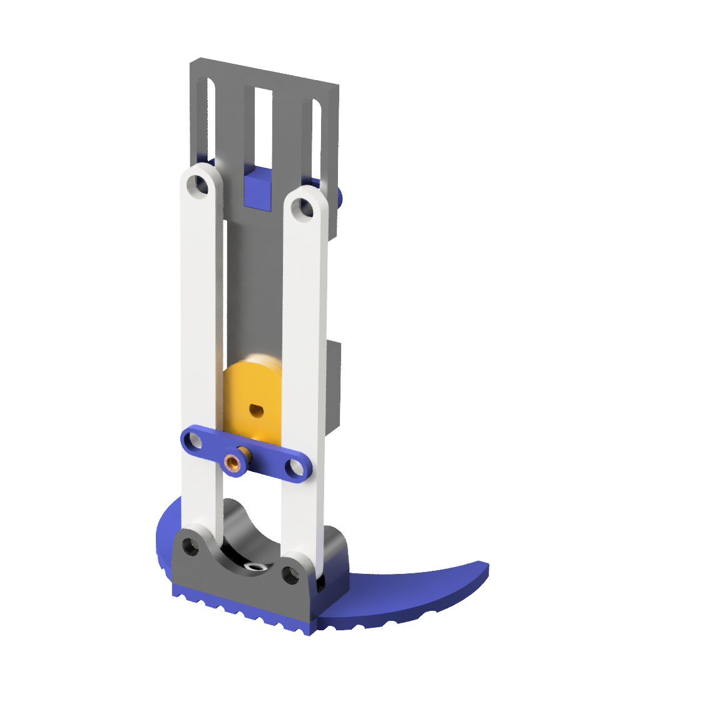
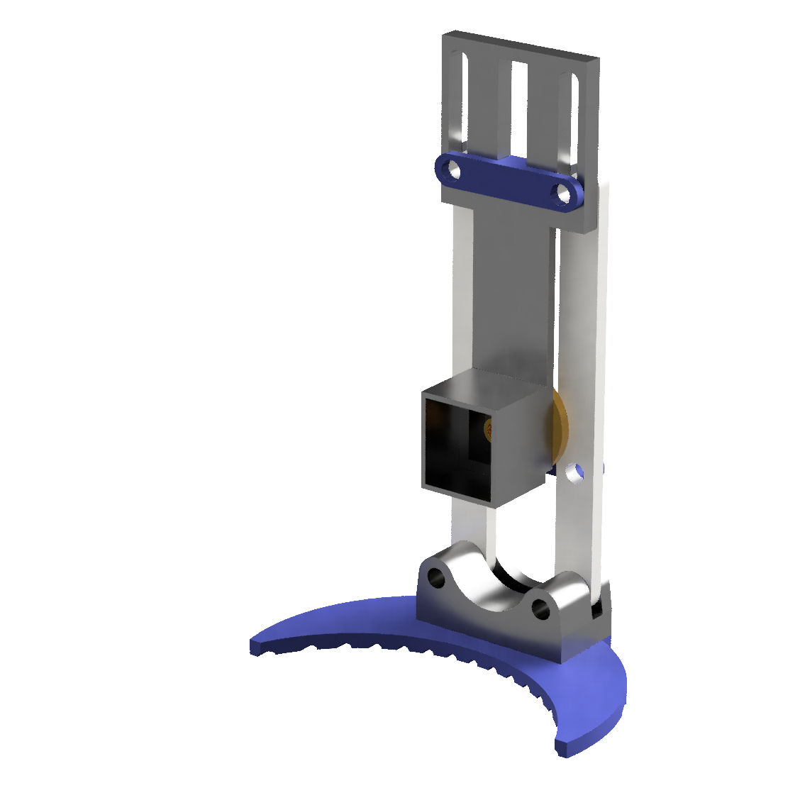
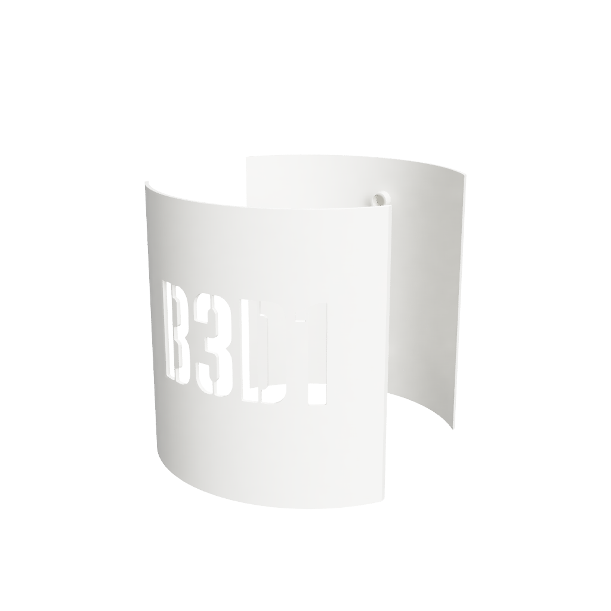

# 行走機器人 (B3D1) 專案 

## 這是什麼？

行走機器人 (B3D1) 的名稱可能讓人聯想到 R2D2，但它實際上代表「Beets 3D1mension」，是對 Beets3D 這個創新公司及其團隊的致敬。

{ width=30% }
{ width=30% }
{ width=30% }

這個行走曲柄機器人通過實踐實驗展示基本的行走機制概念。這個教育平台讓學生和教師探索不同的物理特性如何影響機器人的運動。通過使用 LEGO 積木修改關鍵組件，如腿長和腳設計，學生可以研究：

- 行走速度和效率
- 機器人的穩定性和平衡
- 不同的行走步態和模式

理解行走機制、平衡和運動動力學的概念對於深入了解機器人技術至關重要。詳細信息請參閱[行走概念](concept-of-walking.md)頁面。

主要特點：

- 模組化設計，便於修改
- 基本行走功能（向前移動和潛在的左/右轉）
- 可自定義的腳部附件，通過改變腿長和腳設計來實驗不同的概念
- 遙控能力以測試不同的行走模式

這個機器人作為一個優秀的教學工具，幫助理解機械原理、機器人基礎知識以及設計選擇與運動結果之間的關係。

## 你將學到什麼
- **機械原理**：行走機制、平衡、運動動力學
- **設計與實驗**：測試不同的腳部設計、腿長及其對機器人運動的影響
- **電子學**：使用 micro:bit、馬達控制、基本電路
- **編程**：編程控制機器人和遙控
- **工程**：理解齒輪系統、機械優勢
- **問題解決**：分析運動模式、改善穩定性、優化性能
- **文檔**：記錄觀察結果、比較不同配置
- **團隊合作**：協作實驗、分享發現
- **STEM 整合**：將物理概念與現實世界的機器人應用相連接

## 你需要什麼

### 硬體

- 2x BBC micro:bit
- 用於編程的 USB 線（請注意使用 V2 開發此專案）
    - 1x 主要控制板，用於連接 Micro:bit，包括馬達驅動器和電池包（由 Beets3D 開發）
    - 4 x AA 電池
    - 2x 齒輪馬達（N20 DC 馬達）
    - 3D 打印部件（底盤和機械組件）
    - 外殼部件（外部外殼）
    - LEGO 積木（用於修改）

### 軟體
- MakeCode for micro:bit（基於網頁的編程平台或使用 iPad 應用）
- 3D 打印軟體（用於自定義部件，建議使用 Fusion 360）

### 工具
- 螺絲刀
- 電線剪/剝線鉗（用於跳線）
- 3D 打印機訪問（用於部件）

### 年齡
適合 11-17 歲 

## 它是如何工作的
{ width=80% }

### 設計

它是使用 Autodesk Fusion 360 設計的，STEP 文件可在[設計文件](cad/Walking-Crank-Robot-v91.step)中獲得。

#### 核心行走機制
   - **馬達單元** - 由 2 個齒輪馬達組成，提供機器人運動所需的扭矩和速度。這些馬達的佈局經過精心設計，以優化行走機制，實現平滑和協調的腿部運動。齒輪設計提高了動力傳輸的效率，確保機器人能夠有效地在各種地形上行駛。 
   {: style="width: 50%; display: block; margin-left: auto; margin-right: auto;"}

   - **腿（左/右）** - 由腿部和模擬行走擺動的機制組成，腳部有 LEGO 兼容的附件，便於自定義和更改腳部設計。這一特性鼓勵學生實驗不同的形狀和大小，觀察它們如何影響機器人的運動和穩定性。
   { width=30%; display: inline-block; margin-right: 10px; } { width=30%; display: inline-block; } 
   { width=30%; display: inline-block; margin-right: 10px; } { width=30%; display: inline-block; }

#### 電子學
   - **主板** - 作為機器人的中央控制單元，具有專用的 Micro:bit 插槽，作為機器人的大腦。它集成了馬達驅動器，並促進了馬達和電池包的無縫連接，確保高效的電力分配和控制。
   - **Micro:bit** - Micro:bit 是一款緊湊且多功能的微控制器，設計用於教育目的。它具有多種傳感器、按鈕和 LED 燈，非常適合編程和機器人項目。在這個機器人中，Micro:bit 作為大腦，控制馬達並處理用戶的輸入。
   {: style="width: 30%; display: inline-block; margin-left: auto; margin-right: auto;"} {: style="width: 30%; display: inline-block;margin-left: auto; margin-right: auto;"}

   - **電池盒** - 電池盒設計用於安全地容納機器人的電源，確保電池受到保護並易於更換。良好的電池盒設計有助於機器人的整體穩定性，保持低重心，這對於有效的行走至關重要。適當的重量分配有助於防止翻倒，增強機器人在運動過程中的平衡。

#### 外殼
   - **機身** - 這是行走機器人的主要機身，設計用於容納內部組件並提供腿部和頭部的結構支持。
   {: style="width: 50%; display: block; margin-left: auto; margin-right: auto;"}

   - **頭部** - 這個組件作為機器人的頭部，提供視覺表示並容納任何必要的傳感器或互動功能。這可以根據學習需求進行自定義。
   {: style="width: 50%; display: block; margin-left: auto; margin-right: auto;"}

   - **外殼** - 這個組件為機器人提供外部外殼，給予良好的外觀並根據需求進行自定義。
   {: style="width: 50%; display: block; margin-left: auto; margin-right: auto;"}

#### 遙控
您可以使用另一個 Micro:bit 來控制行走模式，通過按下 A 或 B 按鈕。每個按鈕對應於一條腿的運動；按下按鈕將使相關的腿向前邁步。例如，假設 A 按鈕控制左腿，B 按鈕控制右腿。當您按下 A 按鈕時，左腿將向前邁步；當您按下 B 按鈕時，右腿將向前邁步。這種設置使您能夠管理兩條腿的運動時間和動作，提供了一個探索「控制時間」如何影響行走過程中的平衡、速度和方向的機會。

#### 自定義選項
   - **LEGO 附件** - 腳部設計允許添加任何 LEGO 附件。
   {: style="width: 30%; display: inline-block; margin-left: auto; margin-right: auto;"} 
   {: style="width: 30%; display: inline-block;margin-left: auto; margin-right: auto;"}

   - **可調腿長** - 通過 LEGO 附件，您可以通過添加 LEGO 積木來調整腿的長度，這將改變每一步的運動範圍。
   - **可調腳形** - 您還可以設計任何形狀以測試不同的行走行為，考慮到平衡。

### 組裝指南
1. 機械組裝
   - 左右腿組裝
   - 馬達和齒輪安裝
   - 主板安裝
   - 將 Micro:bit 安裝到主板
   - LEGO 附件點設置

2. 電子設置
   - Micro:bit 接線
   - 電池包設置

3. 編程
   - 使用 MakeCode 進行基本的 Micro:bit 編程
   - 遙控設置
   - 測試和校準

## 課程計劃
1. **第 1 天：介紹和設計** (45 分鐘)
   - 行走機制原理
   - 機器人組件概述
   - 安全指導
   
2. **第 2 天：組裝** (45 分鐘)
   - 機械組裝
   - 電子連接
   - 初步測試
   
3. **第 3 天：編程** (45 分鐘)
   - MakeCode 基礎
   - 運動編程
   - 遙控設置
   
4. **第 4 天：實驗** (45 分鐘)
   - 腳部設計測試
   - 性能優化
   - 結果文檔

## 練習
1. 基本行走測試
   - 向前/向後移動
   - 速度測量
   - 穩定性評估

2. 設計挑戰
   - 創建不同的腳部設計
   - 測試各種腿長
   - 比較行走效率

3. 文檔
   - 記錄觀察結果
   - 比較不同配置
   - 呈現發現

## 學生/教師材料
### 學生資源

- 附有圖片的組裝指南
- 編程教程
- 實驗工作表
- 設計挑戰任務

### 教師資源
- 詳細的課程計劃
- 評估標準
- 故障排除指南
- 擴展活動 